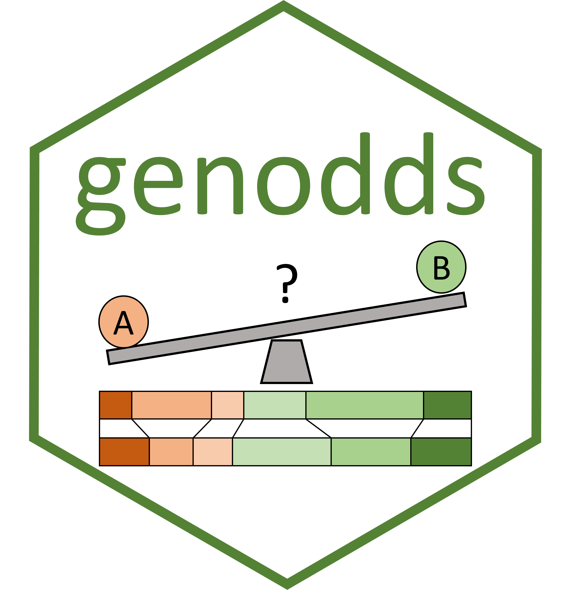

<!-- README.md is generated from README.Rmd. Please edit that file -->

```{r, include = FALSE}
knitr::opts_chunk$set(
  collapse = TRUE,
  comment = "#>",
  fig.path = "man/figures/README-",
  out.width = "100%"
)
```

<!-- badges: start -->
<!-- badges: end -->


#The ``genodds'' package 


##Overview

genodds implements Agresti's [generalized odds ratios](https://www.jstor.org/stable/2530495) for a two-sample dataset. This measure calculates the odds that, if a pair of observation were to be randomly selected from two groups, the observation in one group would have a higher score than those in the other group. The package also provides hypothesis testing for if this odds ratio is different to 1 (no difference between groups), as well as power/sample size estimation capabilities trial planning using this test. This measure can also be reported as [Number Needed to Treat](https://doi.org/10.1111/ijs.12364), a common outcome measure used in health economics.

## Installation

You can install the released version of genodds from [CRAN](https://CRAN.R-project.org) with:

``` {r eval=FALSE}
install.packages("genodds")
```

## Example

genodds can be run as follows:

``` {r example}
library(genodds)
df <- alteplase
genodds(df$mRS,df$treat,df$time)
```
